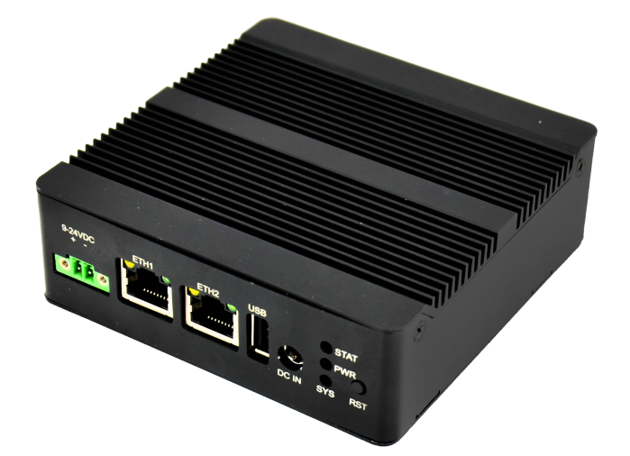
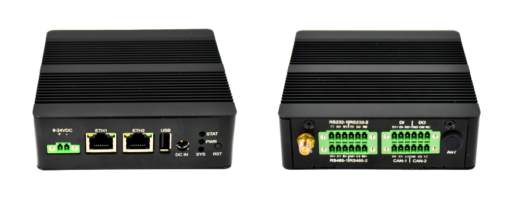
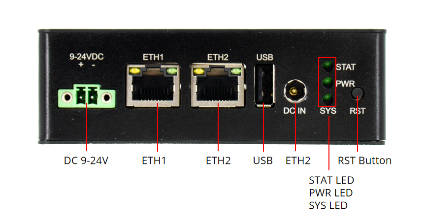
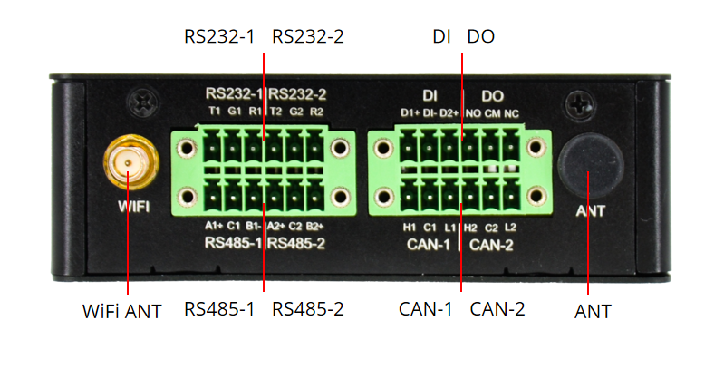

# DEBIX BPC-iMX91-02 IoT Gateway Box PC

## IoT Gateway Box PC Based on NXP i.MX 91 CPU

## Overview

The BPC-iMX91-02 provides a robust and secure data gateway solution for various industrial applications like automation, monitoring, and remote control. Its combination of efficient processing and diverse connectivity options makes it a reliable choice for industrial environments requiring high performance and secure and reliable data communication.

## Main Features

- NXP i.MX 91 processor
- 2 x Gigabit Ethernet, 1 x Wi-Fi 4, 1 x BLE BT5.2 (optional: 4G, LoRa, UWB)
- 1 x USB 2.0 Host (USB OTG available through software configuration)
- 2 x RS485, 2 x RS232, 2 x CAN, 2 x DI, 2 x DO
- 1 x Power LED, 2 x GPIO LED, 1 x Reset key

## Specification

| System | |
| -------- | - |
| CPU | NXP i.MX9131, 1 x Arm Cortex-A55 @1.4GHz   The maximum power consumption is 1.24W.|
| MCU | None |
| GPU | None |
| NPU | None |
| Security | Crypto, Tamper Detection, Secure Clock, Secure Boot, eFuse Key Storage, Random Number |
| Watchdog | Hardware Watchdog |
| Memory | 1GB LPDDR4X (2GB optional) |
| Storage | Onboard 8GB eMMC (16GB/32GB/64GB/128GB/256GB optional) |
| OS | Yocto-L6.12.49, Debian 13 |
| **Communication** | |
| Gigabit Ethernet | 1 x Gigabit Ethernet port, supports TSN   1 x Gigabit Ethernet port |
| 4G | 1 x 4G (optional) |
| LoRa | 1 x LoRa (optional) |
| UWB | 1 x UWB (optional) |
| Wi-Fi & BT | 2.4GHz & 5GHz Wi-Fi 4, BT 5.2 |
| **External I/O** | |
| USB | 1 x USB 2.0 Host, USB OTG available via software configuration |
| RS485 | 2 x RS485 (Non-isolated as standard, isolated optional) |
| RS232 | 2 x RS232 (Non-isolated as standard, isolated optional) |
| CAN | 2 x CAN (Non-isolated as standard, isolated optional) |
| DIO | 2 x DI, 2 x DO (Non-isolated as standard, isolated optional):    - Non-isolated DI (2-ch): Active-low, 3.3V, referenced to DIN_COM   - Non-isolated DO (2-ch): Active-low, 3.3V output   - Isolated DI (2-ch, optional): Active-high, external 5V supply required   - Isolated DO (2-ch, optional): Relay dry contact, max. 250VAC/220VDC, 62.5VA (AC)/60W (DC) |
| LED | 1 x Power LED, 2 x GPIO LED (STAT LED and SYS LED, functions can be customized) |
| Reset | 1 x Reset Key |
| SMA RF | 1 x Wi-Fi antenna, 1 x 4G/LoRa/UWB antenna (optional) |
| **Internal I/O** | |
| Slot | 1 x NanoSIM card slot   1 x MicroSD card slot |
| **Power Supply** | |
| Power Input | DC 12V/2A, 1 x DC socket, 1 x 2Pin 3.5mm Phoenix, support 9V~24V wide voltage input |
| **Mechanical & Environmental** | |
| Enclosure Material | Aluminum alloy |
| Dimension | 107mm(W) x 107mm(D) x 35mm(H) |
| Net Weight | 367g |
| Operating Temp. | -20°C to 70°C (-40°C to 85°C optional) |

## I/O Interfaces

## Safety Instructions

To avoid malfunction or damage to this product please observe the following:

- Disconnect the device from the DC power supply before cleaning. Use a rag. Do not use liquid detergents or spray-on detergents.
- Keep the device away from moisture.
- During installation, put the device on a reliable table. It will be damaged if you drop it.
- Before connecting the power supply, ensure that the voltage is in the required range.
- Put the power cable in place to avoid stepping on it.
- If the device is not used for a long time, power it off to avoid damage caused by sudden overvoltage.
- For safety reasons, the device can only be disassembled by professional personnel.
- Do not place the device in an environment outside its specified operating temperature range. This will damage the machine. It needs to be kept in an environment at controlled temperature.

## Contact Us

- **Headquarters**: DEBIX Technology Inc., 8345 Gold River Ct., Las Vegas, NV 89113, USA
- **Factory**: 5-6/F., East Zone, Shunheda A2 Building, Liuxiandong Industrial Park, Xili, Nanshan Dist., Shenzhen, China   
- **Email**: info@debix.io   
- **Website**: [www.debix.io](https://www.debix.io)
- **Community**: [Discord](https://discord.com/invite/adaHHaDkH2)
